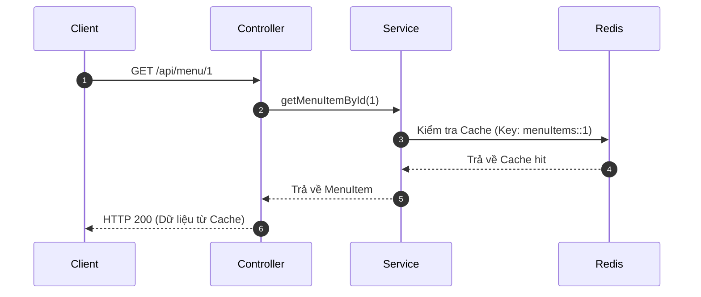
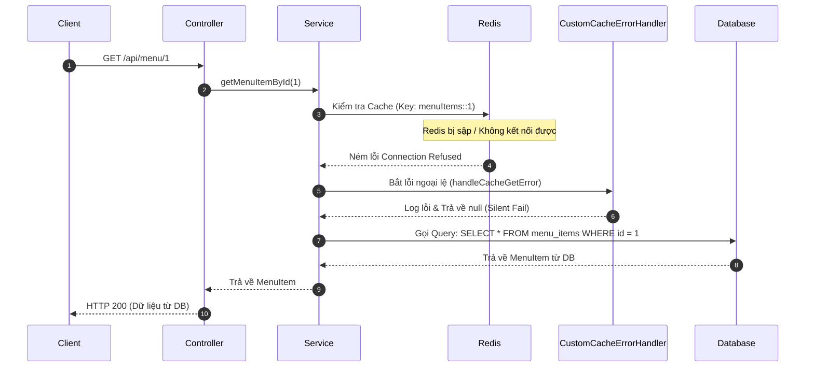

# BÀI TẬP 5: XỬ LÝ NGOẠI LỆ VÀ FALLBACK CHIẾN LƯỢC (SILENT FAIL & HIGH AVAILABILITY)

## 1. Giới thiệu giải pháp
Trong các ứng dụng hiệu năng cao như GrabFood, Redis được sử dụng làm bộ nhớ đệm (Cache) để giảm tải cho cơ sở dữ liệu (Database). Tuy nhiên, nếu cụm Redis gặp sự cố (mất kết nối, sập node), cơ chế mặc định của Spring Cache sẽ ném ra lỗi ngoại lệ (thường là `RedisConnectionFailureException`) dẫn đến phản hồi API trả về mã lỗi 500 làm ảnh hưởng trải nghiệm người dùng.

Giải pháp xử lý là áp dụng cấu trúc **Silent Fail & Fallback**: Khi xảy ra sự cố với Redis Cache, hệ thống sẽ tự động bắt ngoại lệ này thông qua `CacheErrorHandler` tùy chỉnh, thực hiện ghi log cảnh báo và tiếp tục chuyển tiếp yêu cầu lấy dữ liệu trực tiếp từ Database. Người dùng hoàn toàn không cảm nhận được lỗi hệ thống (HTTP 200 vẫn được duy trì).

---

## 2. Kiến trúc & Sơ đồ Luồng Hoạt Động (Mermaid)

### Luồng Xử Lý Bình Thường (Redis Hoạt Động):


### Luồng Xử Lý Khi Có Sự Cố (Redis Sập - Fallback Hoạt Động):


---

## 3. Cách Đăng Ký CustomCacheErrorHandler

Để đăng ký lỗi xử lý tuỳ chỉnh thay vì ném thẳng Exception lên Controller, chúng ta thực hiện triển khai interface `CachingConfigurer` trong lớp cấu hình `@Configuration` và ghi đè phương thức `errorHandler()` để trả về thực thể `CustomCacheErrorHandler` mà chúng ta đã định nghĩa:

```java
@Configuration
@EnableCaching
public class CacheConfig implements CachingConfigurer {
    // ... cấu hình RedisCacheConfiguration ...

    @Override
    @Bean
    public CacheErrorHandler errorHandler() {
        return new CustomCacheErrorHandler();
    }
}
```
Khi Spring thực hiện các tiến trình can thiệp cache (`@Cacheable`, `@CachePut`, `@CacheEvict`), nếu có lỗi kết nối hoặc bất kỳ `RuntimeException` nào phát sinh từ phía Cache Provider, Spring Cache Interceptor sẽ ủy thác lỗi đó sang các hàm tương ứng của `CustomCacheErrorHandler`:
- `handleCacheGetError`: Bắt lỗi khi đọc cache. Trả về trạng thái `null` để Spring tiếp tục thực thi hàm gốc tìm kiếm dưới DB.
- `handleCachePutError`: Bắt lỗi ghi dữ liệu mới vào cache. Bỏ qua và chỉ log thông tin lỗi.
- `handleCacheEvictError`: Bắt lỗi xóa cache. Bỏ qua và chỉ log thông tin lỗi.

---

## 4. Kiểm thử Chịu lỗi (Fault-Tolerance Testing)

### Bước 1: Khởi động Ứng dụng & Redis đang hoạt động
1. Khởi động Docker container chứa Redis: `docker run -d --name redis-lab -p 6379:6379 redis:alpine`
2. Khởi chạy ứng dụng Spring Boot.
3. Tạo bản ghi mới thông qua POST API:
   `POST http://localhost:8080/api/menu`
   `Body: { "name": "Phở bò Đặc Biệt", "price": 65000.0, "description": "Phở bò truyền thống" }`
4. Gọi API GET để ghi nhận dữ liệu vào Cache:
   `GET http://localhost:8080/api/menu/1`
   - Console log hiển thị dòng: `Executing database query to fetch MenuItem with ID: 1` (Lấy từ DB lần đầu).
5. Gọi lại API GET lần 2:
   - Không hiển thị dòng log query DB, dữ liệu trả về cực nhanh (Lấy từ Redis Cache).

### Bước 2: Tắt Redis
1. Thực thi lệnh tắt Redis: `docker stop redis-lab`
2. Gọi lại API GET:
   `GET http://localhost:8080/api/menu/1`
   - Phản hồi từ Postman: **HTTP 200 OK** (Hệ thống không trả về lỗi 500!).
   - Console Log hiển thị lỗi rõ ràng nhưng không ngắt dòng chảy hệ thống:
     ```text
     [ERROR] Redis connection error on GET [cache=menuItems, key=1]. Falling back to Database. Error: Redis connection failure; nested exception is io.lettuce.core.RedisConnectionException: Unable to connect to localhost:6379
     [INFO ] Executing database query to fetch MenuItem with ID: 1
     ```

### Bước 3: Bật Redis trở lại
1. Thực thi lệnh khởi động lại Redis: `docker start redis-lab`
2. Gọi lại API GET:
   - Hệ thống kết nối lại thành công, lưu lại giá trị vào cache và không in thêm log kết nối lỗi.

---
## 5. Kết luận
Việc tích hợp `CustomCacheErrorHandler` đã giải quyết bài toán chống chịu lỗi (Fault-Tolerance) cực kỳ hiệu quả, chuyển đổi mượt mà hoạt động đọc ghi giữa Cache và Database, nâng cao đáng kể độ tin cậy và tính sẵn sàng cao (High Availability) cho toàn hệ thống.